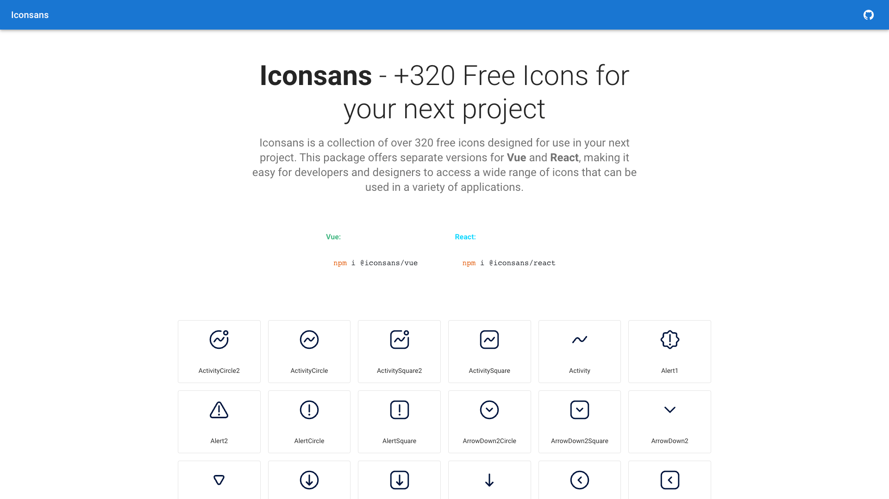

# 🎉 Iconsans

**Iconsans** is a collection of over **320** free icons designed for use in your next project. This package offers separate versions for Vue and React, making it easy for developers and designers to access a wide range of icons that can be used in a variety of applications.

## 🌐 Demo: https://mortezasabihi.github.io/iconsans/



## 🔧 Installation

To use iconsans in your **Vue** project:

```
npm install @iconsans/vue
```

To use iconsans in your **React** project:

```
npm install @iconsans/react
```

## 🚀 Usage

After installing iconsans, you can use it in your project by importing the icons you need. For example, if you want to use the "play" icon in your Vue project, you can import it like this:

```js
<script setup lang="ts">
    import { Play } from "@iconsans/react";
</script>


<template>
    <Play />
</template>

```

In React, you can import the same icon like this:

```jsx
import { Play } from "@iconsans/vue";

export default function App() {
  return <Play />;
}
```

## 🖌️ Props

| Name   | Type          |
| ------ | ------------- |
| Width  | String,Number |
| Height | String,Number |
| Color  | String        |

### 🎨 Figma Design

The icons in iconsans were designed using Figma, and you can find the design file in the following link:

🔗 https://www.figma.com/community/file/1228322259720738019

You can use this design file to view the icons, modify them, or create your own custom icons based on the iconsans design.

### 📄 License

iconsans is licensed under the MIT license, which means you are free to use it in your projects, both commercial and non-commercial. However, we do ask that you provide attribution to the iconsans project in your documentation and/or about page.
